# How to connect MadCap Flare to GitHub Pages

> [!CAUTION]
> Make sure that you arleady have installed Git on your computer. 
>
> If not, you can use this [LINK](https://git-scm.com/downloads) to download.

## Step 1. Connect your MadCap Flare project to the GitHub repository

1. Create a new GitHub repository.

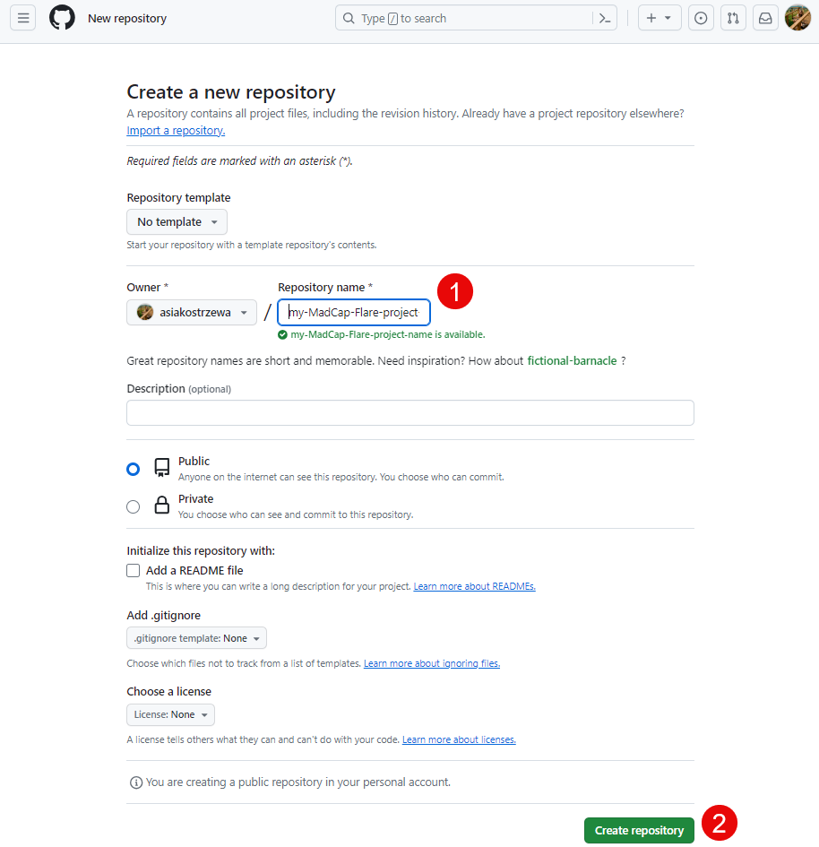

2. Copy the link to your new repository.

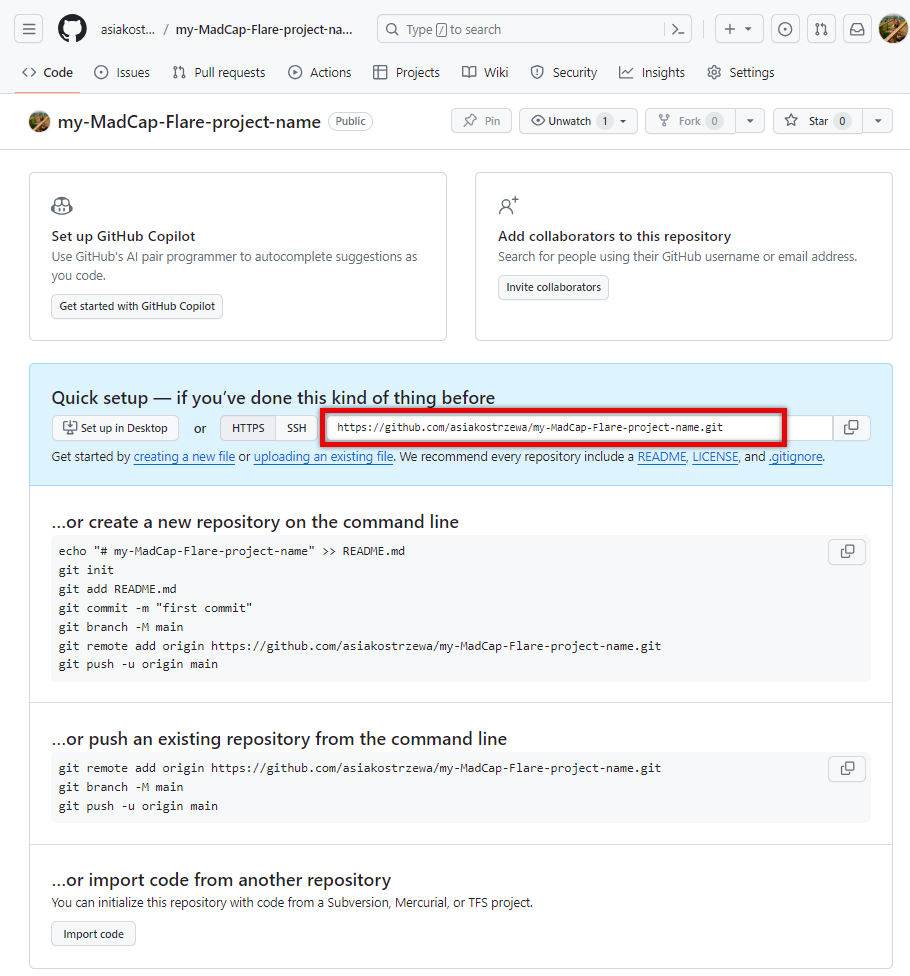

3. In your MadCap Flare, click **Project** > **Project Properties** > **Source Control** > **Bind Project**.

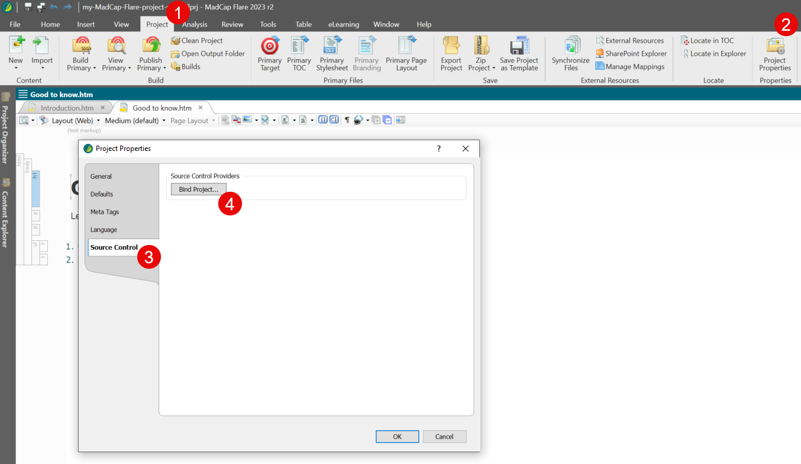

4. Choose **Git** as your Source Control Provider.
5. Choose the **Remote Repository** checkbox.
6. Choose the **Push on bind** checkbox.
7. Paste the link to your repository.
8. Enter your name, email address and click **OK**.

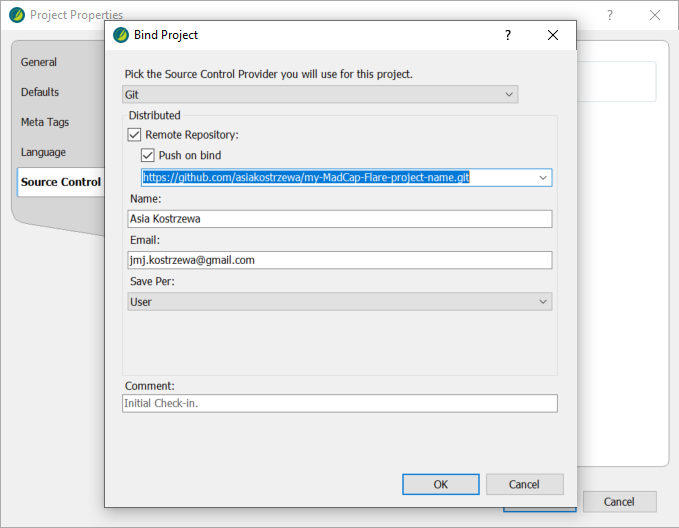

>[!NOTE]
> MadCap Flare may ask you to enter your GitHub login and password here. When such a dialog box appears, provide these data.

9. Go to your GitHub repository and refresh the page to see the changes.

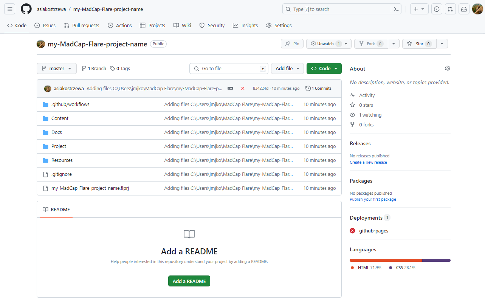

Your local project has been uploaded to your GitHub repository.

## Step 2. Project preparing for publication on GitHub Pages

1. In your MadCap Flare, click **Project Organizer** > **Targets** > **HTML5** > **General** and change 'home.htm' to 'index.html' in **Output File** section.

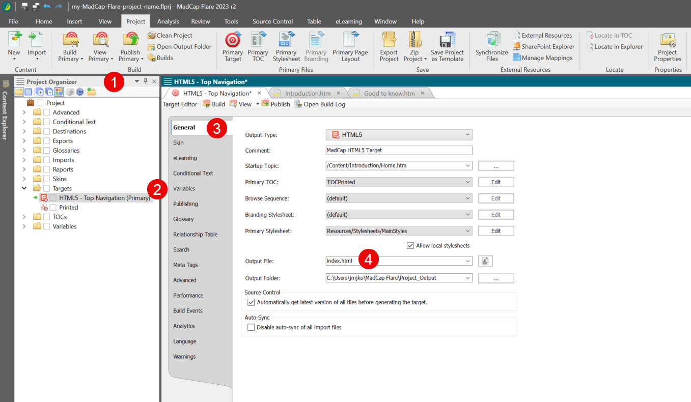

Save changes.

2. Create a new Publishing Destination using **Project Organizer** > **Targets** > **HTML5** > **Publishing** > **New Destination...** and clicking **Add**.

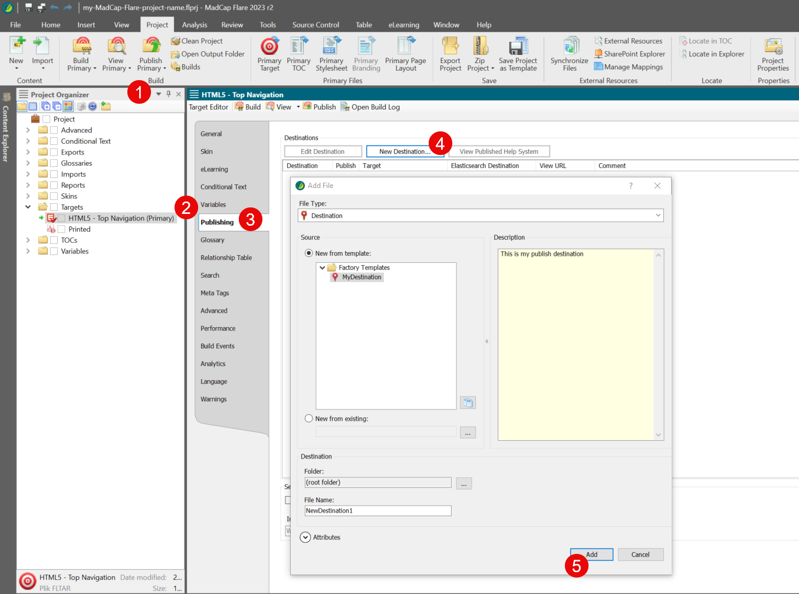

3. Create a target folder "Docs" in your local project. It should be in the main directory of the project that we bind with Git.

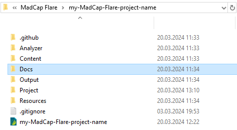 

> [!CAUTION]
> The name of the target folder is case-sensitive.
> 
> Example: if you named the folder "Docs" - enter the name in capital letter. If you used "docs", then enter lowercase letters.

4. Choose Source Control type and provide the target folder destination.

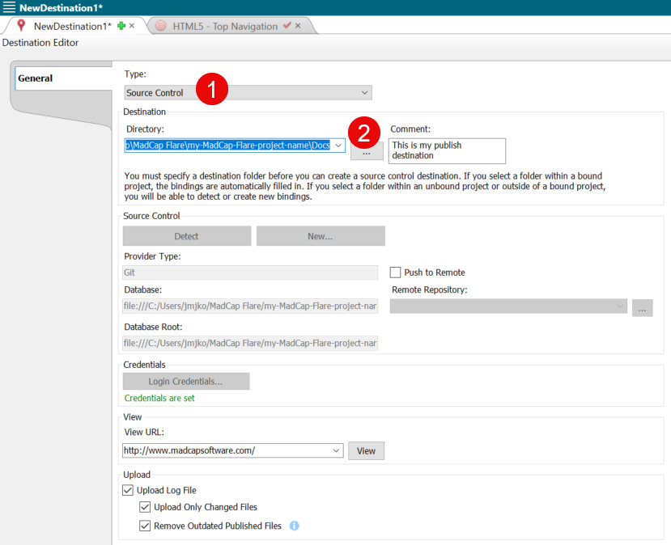

Save your work.

5. Go back to the **Project Organizer** > **Targets** > **HTML5** > **Publishing** menu and select **Publish** checkbox.

Save changes and click **Publish**.

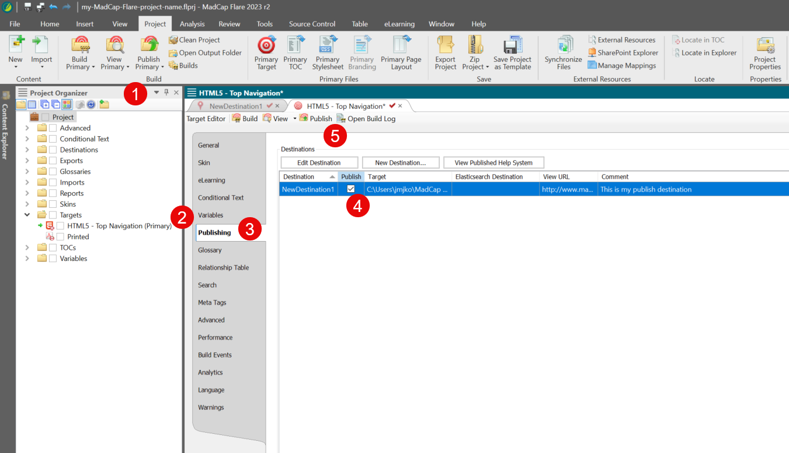

The output with your completed website should jump into the folder you just selected (in my case: "Docs").

>[!NOTE]
> From now on, in the "Source Control" menu (at the top, in the taskbar), you will find standard Git operations - commit, pull and push.
> 
> Now you can change the local files in your MadCap project, commit the changes and push them to the remote repository.

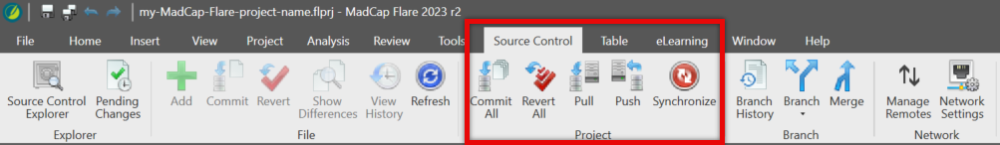

## Step 3. Project publication

Select **Project** > **Publish Primary** > **Publish "HTML5"**

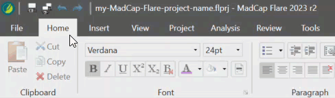

Now the entire project should be uploaded to your GitHub repository.

## Step 4. Publish as GitHub Pages

1. Open your GitHub repository settings.
Select **Pages** and set **GitHub Actions** as a GitHub Pages source.

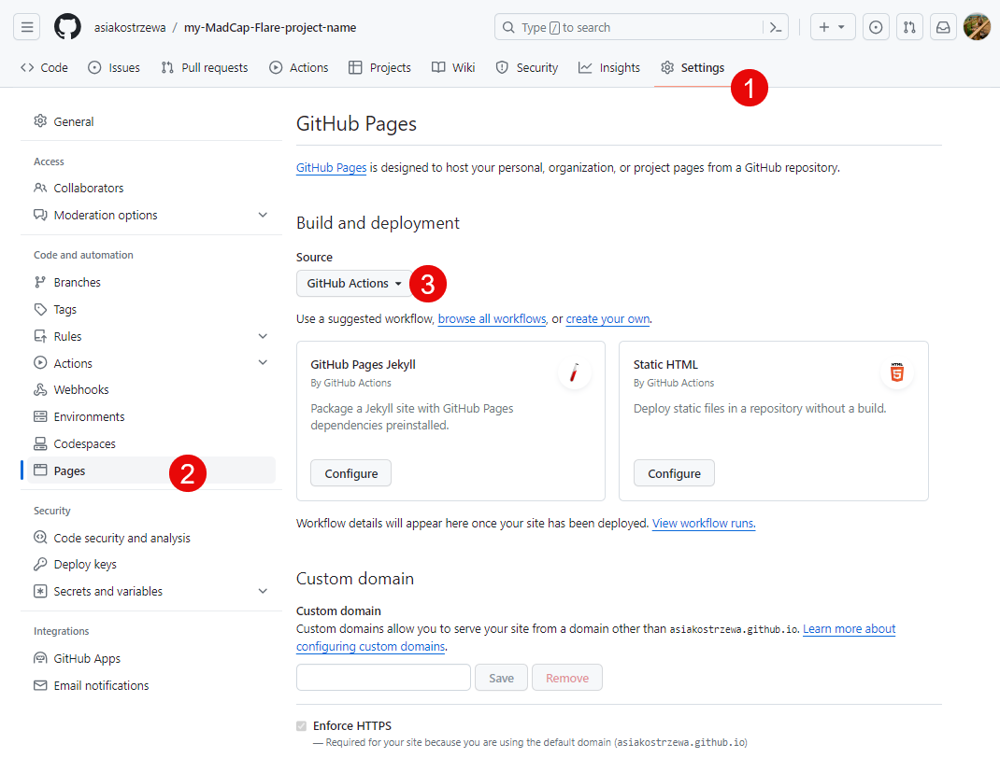

1. Select **Actions** section and click **New workflow**.

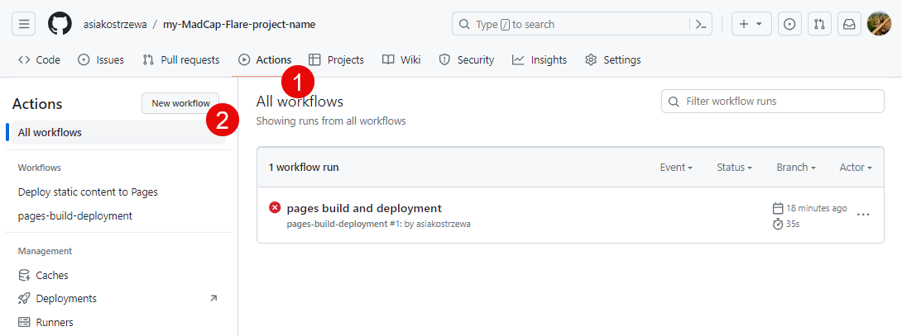

3. Search for **static** in **Search workflows** and click **Configure** for **Static HTML**.

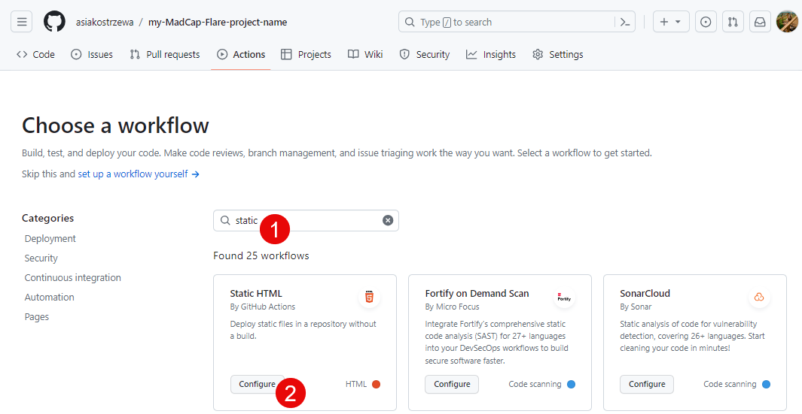

4. Change path from '.' to 'Docs' and click **Commit changes...**.

> [!CAUTION]
> Remember that the name of the target folder is case-sensitive.

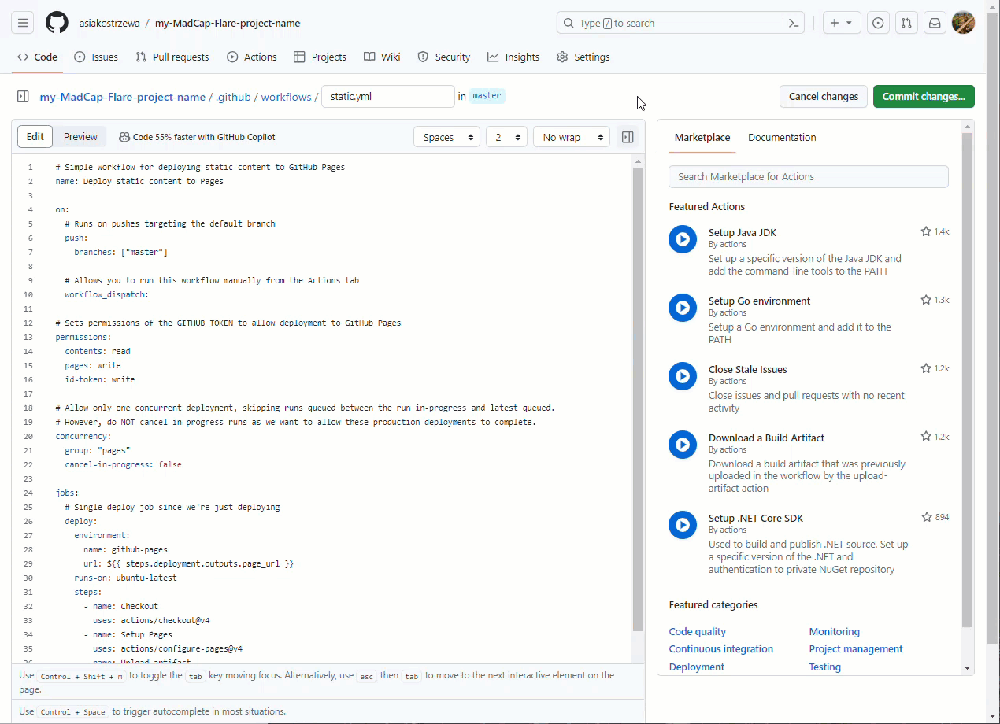

5. Select **Actions** section and click **Deploy static content to Pages**.
Click **Run workflow** for branch: master.

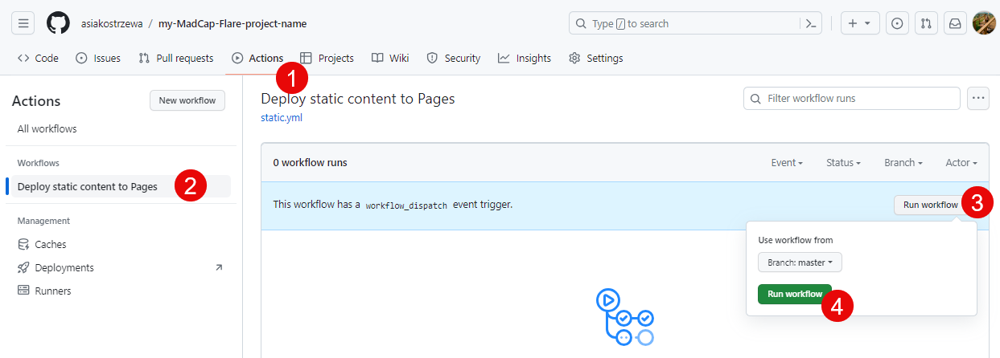

...and YOU GOT IT! Congratulations! 🎉

Now you can go to **Deployments** in your GitHub repository and admire your website implemented directly from MadCap Flare to GitHub Pages! 🚀

### Kindly reminder
Just remember that whenever you make changes in the MadCap Flare project that you want to publish to the website - repeat step 3, publishing the HTML5 result. 

**ENJOY!** 😊

### Sources
- [DocWizard/GHPages-howto](https://github.com/DocWizard/GHPages-howto)
- [Documentation Portal: How to connect MadCap Flare to Git](https://docsy-site.netlify.app/docs/madcap-flare/connect-madcap-to-git/#bind-using-the-flare-interface)